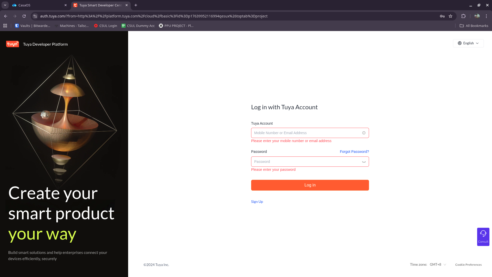
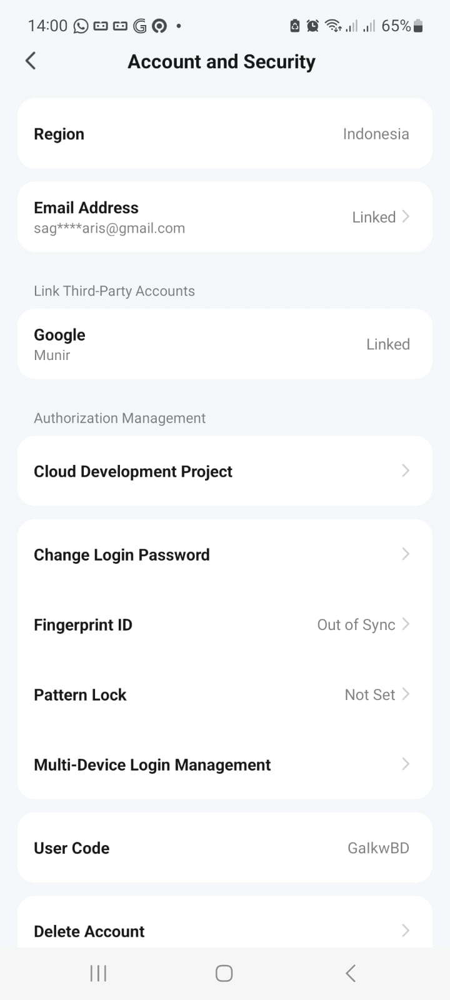
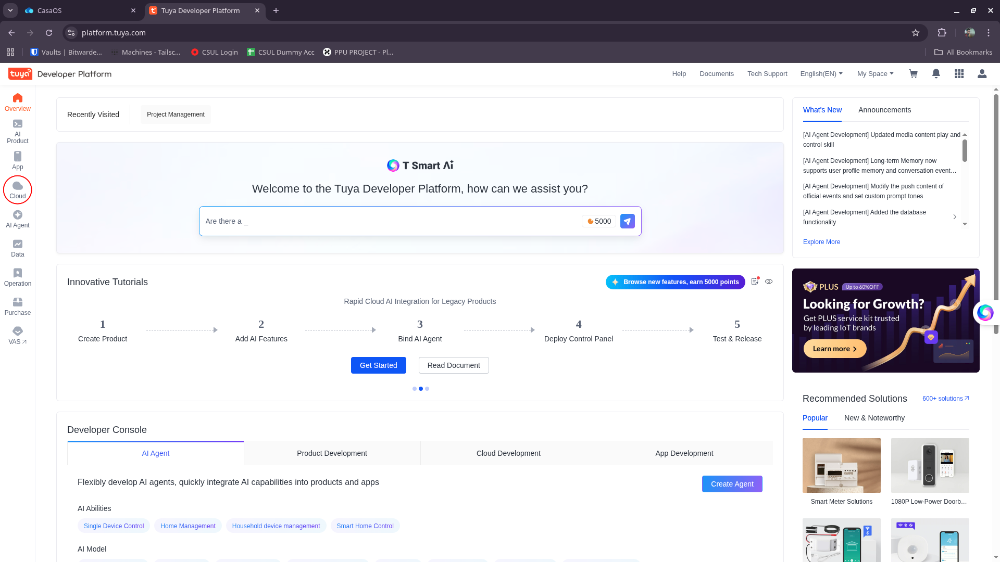
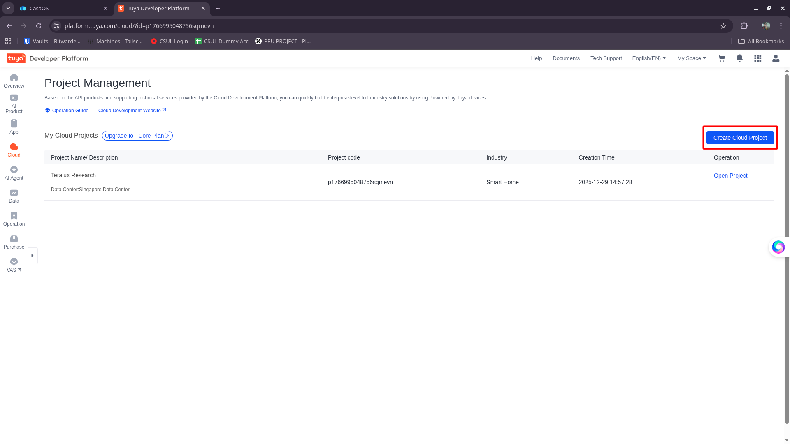
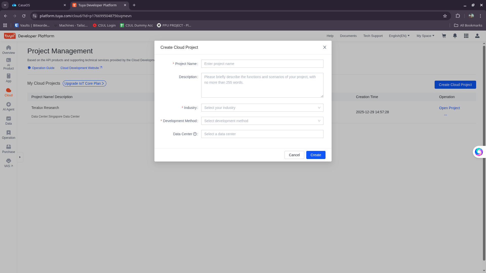
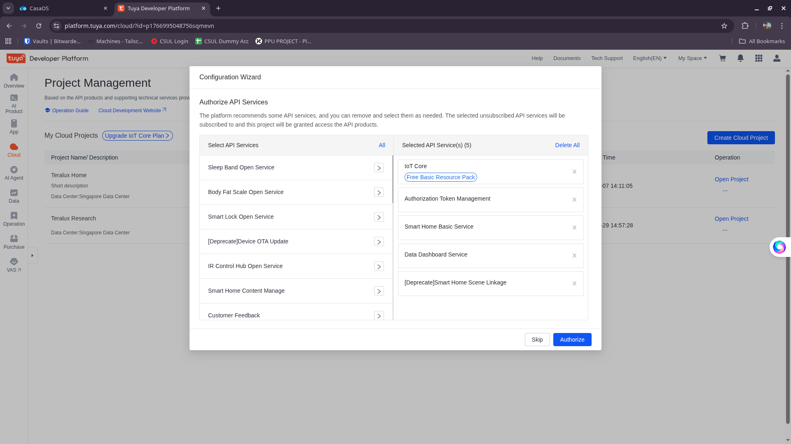

# Tuya Cloud Project Setup

To connect Teralux devices with the backend, you need to create a Project on the Tuya IoT Platform. Here are the steps:

## 1. Tuya Account Registration

The first step is to have a Tuya IoT Platform account.

1.  Visit [Tuya IoT Platform](https://iot.tuya.com/).
2.  Click the **Sign Up** button if you don't have an account, or **Log In** if you already do.

    

3.  Log in to your account.

    

## 2. Check Smart Life Region (Important!)

Before creating a project, you must ensure your Smart Life account region matches the data center you will select.

1.  Open your **Smart Life App** on your phone.
2.  Go to **Settings** -> **Account and Security**.
3.  Check the **Region**.

    

> [!WARNING]
> If your Smart Life account is registered in Indonesia, you MUST select **Singapore Data Center** when creating the cloud project. Also, for the Singapore Data Center, you will need to set the `TUYA_BASE_URL` in your backend `.env` file to `https://openapi-sg.iotbing.com`. If the regions do not match, the device linking will fail.

## 3. Create Cloud Project

After successfully logging in, you need to create a Cloud Project to obtain the API Key and Secret required by the backend.

1.  On the main page (Dashboard), click the **Cloud** menu in the left sidebar or top navbar (depending on the layout).

    

2.  Go to the **Cloud Services** page, then click **Development** -> **Project**.
3.  Click the **Create Cloud Project** button.

    

4.  Fill in the project creation form:
    *   **Project Name**: Any name (e.g., `Teralux Home`).
    *   **Description**: Short description.
    *   **Industry**: Select `Smart Home`.
    *   **Development Method**: Select `Smart Home`.
    *   **Data Center**: 
        *   For **Indonesia** users, select **Singapore Data Center**.
        *   Ensure this matches your Smart Life App region.

    

5.  Click **Create**.

6.  **Authorize API Services**:
    After clicking create, a popup will appear showing a list of API services.
    *   Click **Authorize** to proceed with the default selection.
    *   We can configure specific APIs later if needed.

    