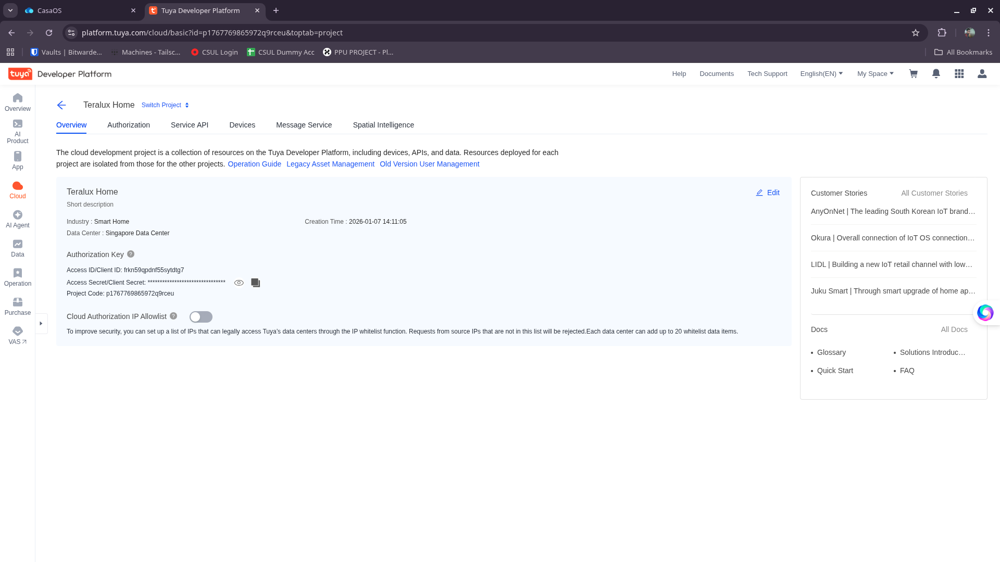
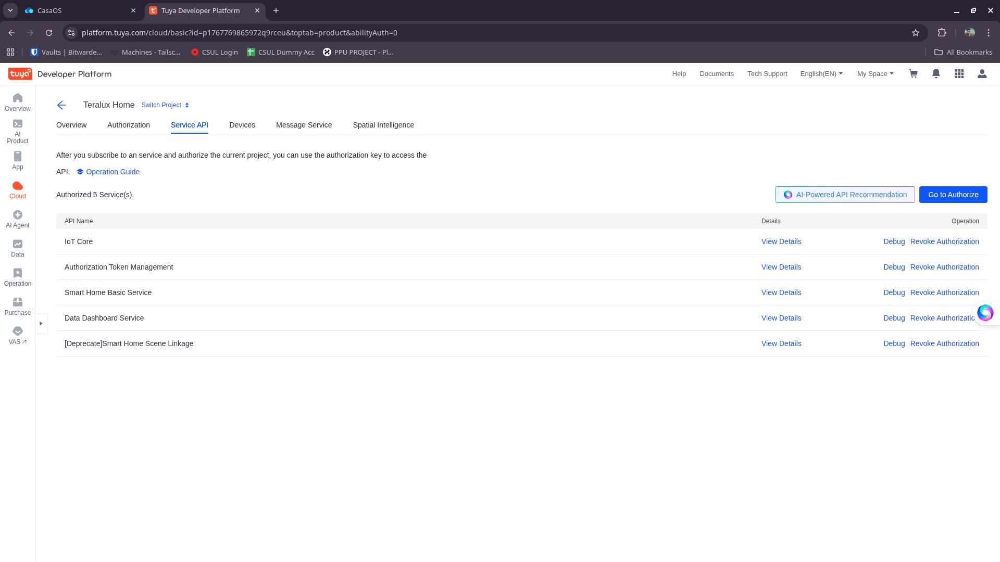
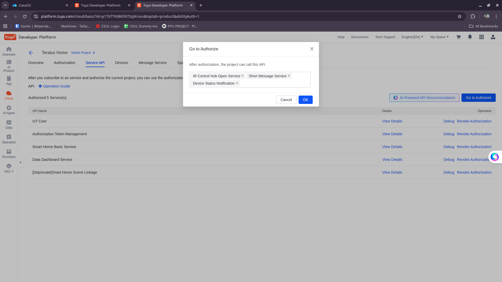

# Credentials & Service API Setup

After successfully creating the project and authorizing the initial services, you need to configure the backend credentials and verify the API permissions.

## 1. Get Credentials

On your Project Overview page, you will see your **Access ID (Client ID)** and **Access Secret (Client Secret)**.

1.  Copy these values.

    

2.  Open your backend `.env` file (copy from `.env.example` if you haven't).
3.  Fill in the credentials:

    ```env
    # Tuya Configuration
    TUYA_CLIENT_ID=your_access_id
    TUYA_SECRET=your_access_secret
    
    # INDONESIA USERS (Singapore Data Center)
    TUYA_BASE_URL=https://openapi-sg.iotbing.com
    ```

## 2. Verify Service APIs

To ensure all features (Device Control, Notifications, etc.) work correctly, we need to verify the authorized services.

1.  Navigate to the **Service API** tab in your project.

    

2.  Click **Go to Authorize**.

    

3.  Ensure the following APIs are selected (authorized):

    *   **IoT Core**
    *   **Authorization Token Management**
    *   **Smart Home Basic Service**
    *   **Data Dashboard Service**
    *   **IR Control Hub Open Service**
    *   **Short Message Service**
    *   **Device Status Notification**

4.  Click **OK** (or Subscribe) to confirm.

> [!IMPORTANT]
> If "IoT Core" or "Smart Home Basic Service" is missing, the application will not be able to control devices or sync status correctly.
