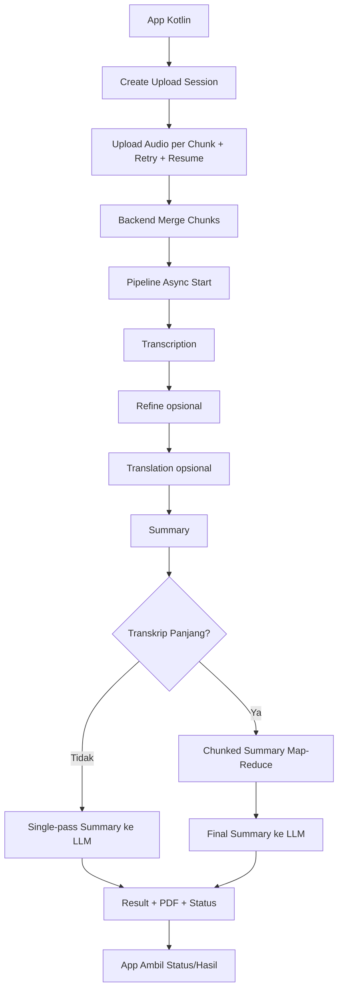
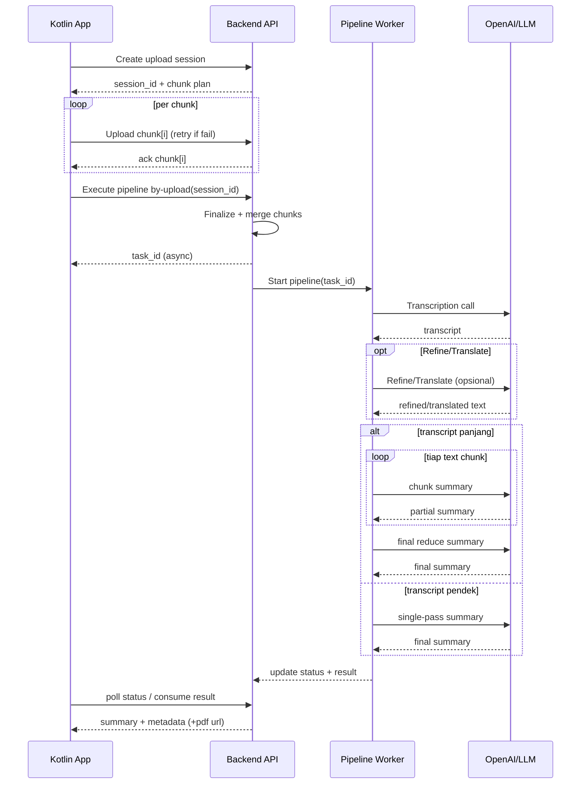

# Report Plan: Metode Chunking Kotlin -> Backend -> OpenAI (Untuk Sharing Internal)

## Summary

Dokumen ini menjelaskan metode chunking end-to-end untuk proses meeting pipeline, dengan fokus pada alur sistem, algoritma, tradeoff token, dan rekomendasi optimasi agar siap dibagikan ke rekan kerja.

## Tujuan dan Success Criteria

1. Menjelaskan dua jenis chunking yang dipakai dan perannya masing-masing.
2. Menyajikan alur lengkap dari app sampai hasil akhir.
3. Menyediakan diagram flow dan sequence untuk materi presentasi.
4. Menjawab tegas apakah metode ini boros token LLM atau tidak.
5. Menyertakan rekomendasi implementasi dan optimasi token.

## Cakupan

1. Alur upload chunked audio dari app ke backend.
2. Alur pipeline async sampai summary final.
3. Algoritma chunked summarization pola map-reduce.
4. Analisis dampak biaya token.
5. Rekomendasi optimasi operasional.

## 1) Ringkasan Eksekutif

Metode ini memakai dua jenis chunking yang berbeda fungsi:

1. Chunking file audio saat upload dari app (Kotlin) ke backend.
2. Chunking teks transkrip saat backend membuat summary ke LLM (termasuk OpenAI saat provider = OpenAI).

Tujuan utama:

1. Upload file besar stabil dan bisa resume.
2. Summary transkrip panjang aman terhadap batas context model.
3. Pipeline tetap terpantau progresnya (MQTT/polling) hingga selesai.

## 2) Alur End-to-End (Konseptual)

## 3) Algoritma Utama

### A. Algoritma chunking upload audio (App -> Backend)

1. App membuat upload session.
2. Backend mengembalikan metadata session: session ID, total chunk, chunk size, expiry.
3. App memecah file audio menjadi chunk ukuran tetap.
4. App upload chunk secara paralel dengan batas concurrency.
5. Setiap chunk menggunakan retry dengan exponential backoff.
6. Saat koneksi putus, app cek status session dan hanya upload chunk yang hilang.
7. Setelah semua chunk diterima, app trigger pipeline by-upload.
8. Backend validasi session lalu merge chunk berurutan menjadi satu audio utuh.
9. File hasil merge masuk ke pipeline transkripsi.

Karakteristik:

1. Reliable untuk file besar.
2. Mendukung resume.
3. Tidak mengulang transfer chunk yang sudah sukses.

### B. Algoritma chunking summary teks (Backend -> LLM/OpenAI)

Pola yang dipakai adalah map-reduce:

1. Cek panjang transkrip.
2. Jika pendek, jalankan single-pass summary (1 kali panggil LLM).
3. Jika panjang, jalankan chunked summary:
4. Split teks menjadi beberapa chunk dengan boundary semantik (newline/akhir kalimat).
5. Panggil LLM per chunk untuk summary parsial (map step).
6. Gabungkan seluruh summary parsial.
7. Jalankan final summarization dari gabungan parsial (reduce step).
8. Simpan hasil akhir beserta metadata dan artifact (misalnya PDF).

Keuntungan:

1. Aman terhadap batas context window.
2. Menurunkan risiko gagal total di transkrip panjang.
3. Lebih robust untuk meeting panjang dan multi-topik.

## 4) Diagram Sequence (Untuk Presentasi)

## 5) Jawaban Pertanyaan Token: Boros atau Tidak?

Jawaban singkat:

1. Audio chunking upload tidak menambah token LLM.
2. Text chunking summary cenderung menambah total token dibanding single-pass, tetapi sering wajib untuk reliability pada teks panjang.

Penjelasan:

1. Prompt instruksi diulang pada tiap chunk.
2. Ada panggilan tambahan pada tahap reduce.
3. Untuk teks yang sebenarnya muat single-pass, chunking biasanya lebih mahal.
4. Untuk teks panjang yang berisiko melebihi context, single-pass bisa gagal/terpotong/halusinasi, sedangkan map-reduce lebih stabil.

Kesimpulan operasional:

1. Bukan boros tanpa manfaat.
2. Ini overhead terkontrol untuk ketahanan pada skala input panjang.
3. Untuk teks pendek, tetap disarankan single-pass.

## 6) Rekomendasi Efisiensi Token

1. Pertahankan mode hybrid: single-pass untuk teks pendek, chunked untuk teks di atas threshold.
2. Pendekkan instruksi prompt pada tahap per-chunk.
3. Batasi panjang output summary parsial agar reduce step tidak membengkak.
4. Gunakan model lebih ekonomis di map step dan model lebih kuat di reduce step.
5. Tambahkan metrik observability: jumlah_chunk, input_tokens, output_tokens, cost_per_task.

## Perubahan/Public Interface Konseptual

1. `UploadSession`: `session_id`, `state`, `total_chunks`, `chunk_size`, `missing_ranges`.
2. `PipelineTask`: `task_id`, `overall_status`, `stages`.
3. `SummaryMode`: `single_pass` atau `chunked_map_reduce`.
4. `SummaryResult`: `summary`, `metadata`, `artifact_url`.

## Test Cases dan Skenario Validasi

1. Upload file kecil sukses tanpa resume.
2. Upload file besar sukses dengan paralel chunk.
3. Resume sukses setelah putus koneksi.
4. Finalize gagal saat chunk belum lengkap.
5. Summary pendek memakai single-pass.
6. Summary panjang memakai chunked map-reduce.
7. Partial chunk summary gagal sebagian namun proses tetap recover.
8. Perbandingan token single-pass vs chunked untuk input identik.
9. Monitoring status pipeline konsisten dari pending sampai completed/failed.

## Asumsi dan Default

1. Audiens adalah rekan kerja teknis internal.
2. Dokumen ditulis dalam format Markdown + Mermaid.
3. Fokus pada alur dan algoritma, bukan detail file implementasi.
4. Default strategi: single-pass untuk pendek, chunked map-reduce untuk panjang.
