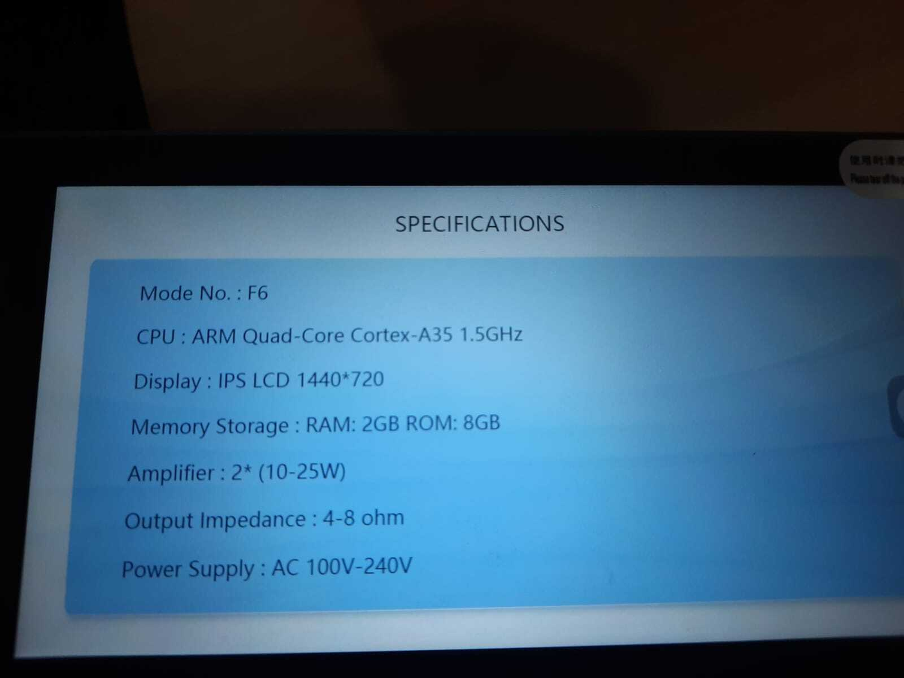
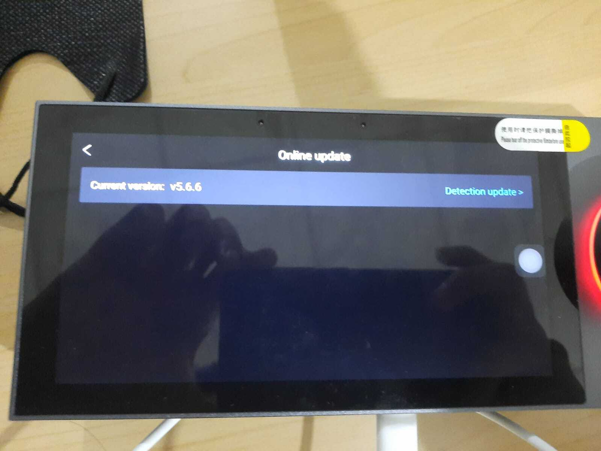

# TERALUX Nexus Panel 6 INCH - Smart Home Gateway

## Product Specifications

| Aspect | Detail |
|-------|--------|
| **Brand** | Teralux |
| **Product** | Touch Screen Home Smart Panel |
| **Input Voltage** | 110V - 250V |
| **Network** | Wi-Fi 2.4GHz, Ethernet |
| **Display** | 6 Inch IPS 1440x720 (multi-point capacitive touch) |
| **Bluetooth** | Bluetooth 4.0 |
| **Audio Format** | MP3, WAV, WMA, FLAC, APE, AAC, AC3, OGG |
| **Audio Input** | AUX |
| **Compatible Apps** | Smart Life, Tuya |
| **Control** | Remote App Control |
| **Installation** | Standard Single 86 Wall Box |

## Key Features

- Supports TF Card (max 32GB) and USB (max 32GB)
- Built-in Zigbee Gateway
- Music streaming (customizable)
- Multi-language settings
- Support for over 100 devices
- Timer/scheduling switch
- Personalized screen saver
- Full customization

## Usage

Controls lights, curtains, AC, wall switches, and other smart home devices.

## Visual Documentation

**Note:** This device comes with a Zigbee Gateway as explained in the official user manual.