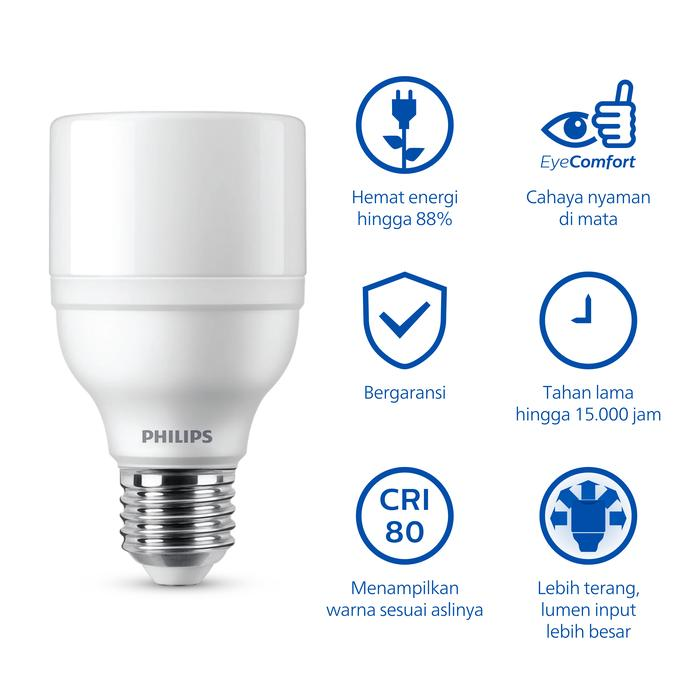
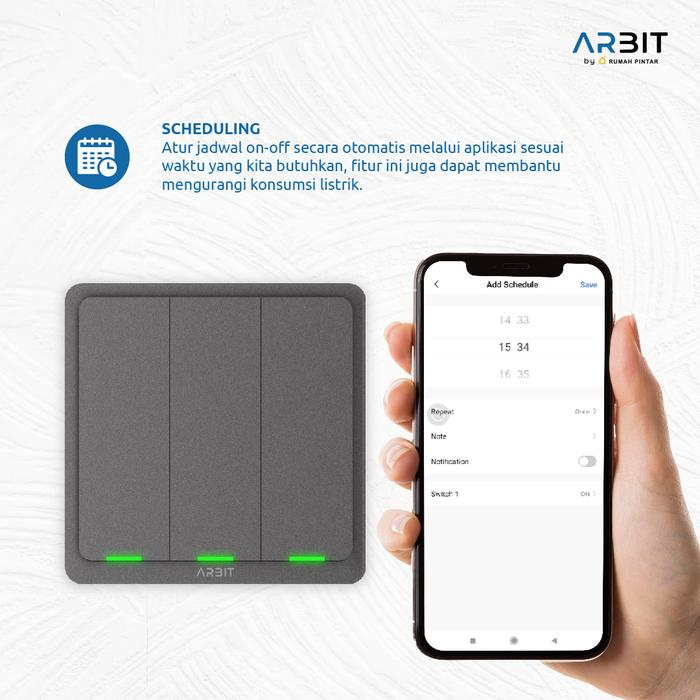
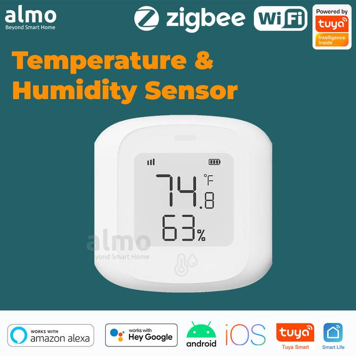
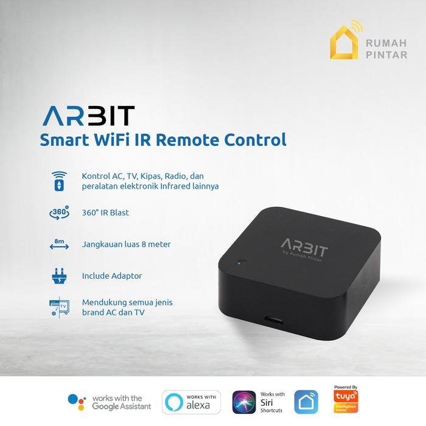
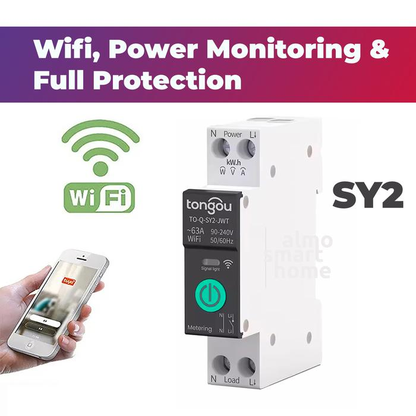

# Device Specifications

Overview of the smart devices compatible with the Teralux ecosystem.

## 1. Philips RadiantLine LED Bulb 12W

*   **Purpose**: High-brightness indoor lighting designed for eye comfort.
*   **Key Specs**:
    *   **Power**: 12W (equivalent to 104W incandescent), 1600 Lumens.
    *   **Color**: 6500K (Cool Day Light).
    *   **Voltage**: 100V - 250V.
    *   **Fitting**: E27.
    *   **Lifespan**: Up to 15,000 hours.

## 2. ARBIT Zigbee Wall Switch

*   **Purpose**: Smart physical wall switch for controlling lights and scheduling. Requires a Zigbee Gateway.
*   **Key Specs**:
    *   **Type**: 1/2/3 Gang (Click Button).
    *   **Wiring**: No neutral wire required (Capacitor embedded).
    *   **Input**: AC 200-240V.
    *   **Max Current**: 10A (500W/Gang).
    *   **Connectivity**: Zigbee.

## 3. ALMO Smart Temperature & Humidity Sensor

*   **Purpose**: Real-time environmental monitoring with an on-device LCD display. Supports automation triggers (e.g., turn on AC).
*   **Key Specs**:
    *   **Connectivity**: Zigbee 3.0 or WiFi 2.4GHz.
    *   **Display**: LCD showing Temperature, Humidity, Battery.
    *   **Range**: -10°C ~ 60°C (Temp), 0% ~ 99% RH (Humidity).
    *   **Power**: AAA Batteries.

## 4. ARBIT Smart WiFi IR Remote

*   **Purpose**: Universal IR blaster to control legacy appliances (AC, TV, Speaker) via the smart home app.
*   **Key Specs**:
    *   **Connectivity**: WiFi 2.4GHz.
    *   **IR Range**: 8 meters (360° coverage).
    *   **Input**: DC 5V/1A (Micro USB, no internal battery).
    *   **Compatibility**: Any device with a standard IR remote.

## 5. TONGOU Smart MCB (SY2)

*   **Purpose**: Smart Miniature Circuit Breaker for safety protection, remote control, and energy monitoring.
*   **Key Specs**:
    *   **Type**: 1P (Single Pole), DIN Rail mount.
    *   **Current Rating**: Adjustable 1A - 63A.
    *   **Protections**: Overload, Short-circuit, Over-voltage, Under-voltage, Temperature.
    *   **Features**: Real-time Energy Monitoring, **Last Status Memory** (restores state after power outage).
