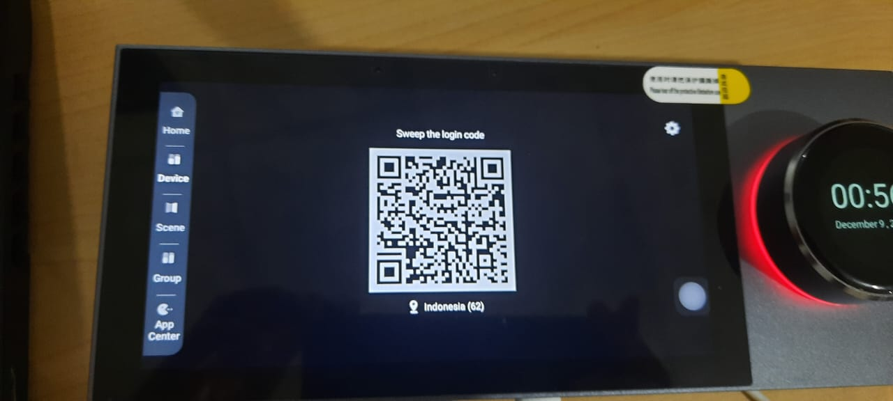
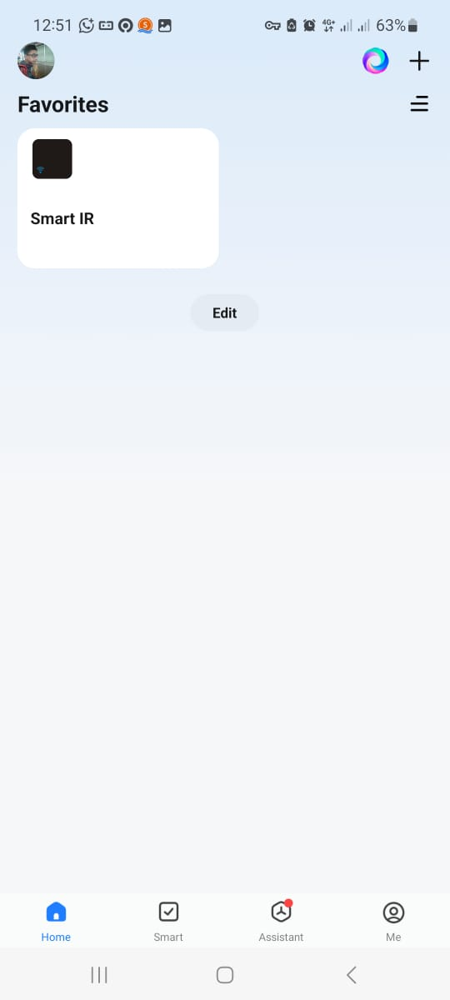
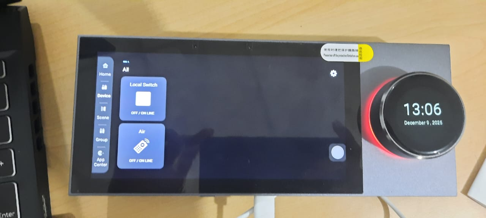
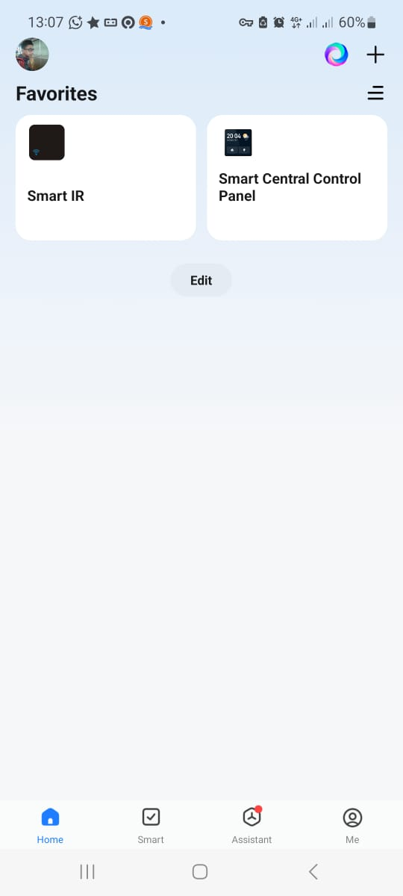
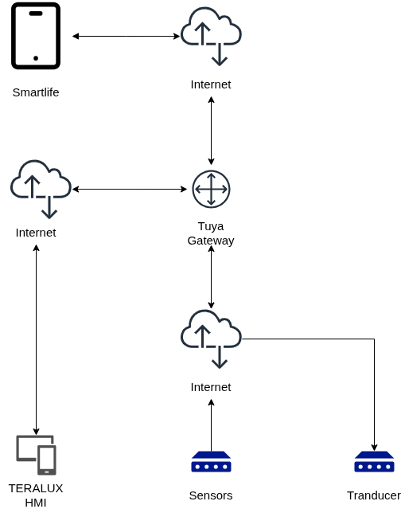

## Device Control Testing via Tuya Platform

Testing was conducted to verify the integration capabilities of smart home devices through the Tuya platform using the Smart Life application. The device supports Zigbee Gateway connectivity which allows local control from the mobile application.

### Device Pairing Procedure

1. **Access HMI Menu**: Open the HMI menu and select the "Device" option to display the device's QR code.

    

2. **Scanning QR Code**: In the Smart Life app, tap the "+" button and scan the QR code displayed on the HMI screen to start the pairing process.

    

3. **Verify Connection**: After successful pairing, the Smart IR device will automatically appear on the HMI screen, allowing the user to control it directly from the panel.

    
    
    

### Test Results

The system successfully integrated the smart home devices into the HMI interface via the Tuya connection.

### System Architecture

The diagram shows the communication flow of the system consisting of:
- **Smartlife**: Mobile application for device control
- **Internet**: Public cloud connectivity
- **Tuya Gateway**: Gateway server managing routing and device authentication
- **TERALUX HMI**: Local control panel with Zigbee integration
- **Sensors & Transducer**: IoT devices in the field connected to the local gateway via Zigbee network

This architecture enables device control both via the mobile app (via Tuya cloud) and locally through the HMI panel.