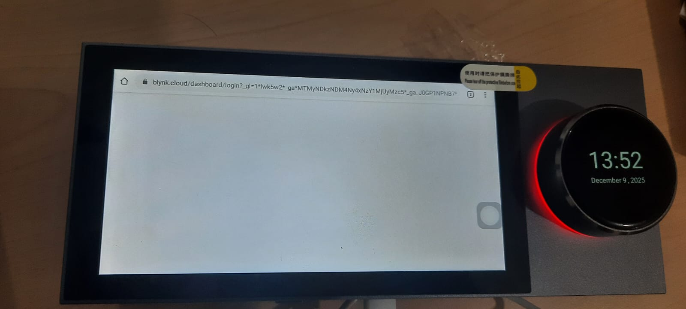
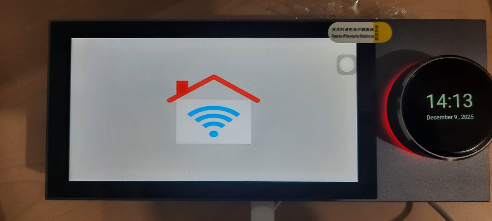

## Testing Without Tuya Protocol

In this phase, we attempted to conduct testing without using the Tuya protocol and explored the Blynk application as an alternative.

### Blynk Application
Blynk is an IoT cloud platform that allows users to build remote control interfaces for electronic devices. The platform provides tools to create interactive dashboards, send notifications, and integrate various sensors and actuators via MQTT or HTTP protocols. Blynk supports various microcontrollers and single-board computers such as Arduino and Raspberry Pi.

#### First Attempt - Failed
Initial testing failed due to browser compatibility issues. When attempting to access the Blynk cloud website, the page could not be accessed because the browser version on the HMI was outdated, a limitation stemming from the legacy OS specifications.

### Alternative: IoT MQTT Panel
Next, we tried using the Android application IoT MQTT Panel. IoT MQTT Panel is an Android app designed to communicate with MQTT brokers, allowing users to send messages and control IoT devices in real-time through an intuitive interface. This app supports the MQTT 3.1.1 protocol and can operate with minimal resource consumption.

Since the HMI does not have access to the Google Play Store, the Blynk app could not be installed. However, as shown in the image below, although the IoT MQTT Panel could be installed, the app failed to run, so further testing could not be conducted.

### Analysis
Android 5 has significant compatibility limitations for Android applications and web access. According to available documentation, these apps require Java 7/8, although Flutter and Kotlin can also be used with certain limitations.

### References
- https://apilevels.com/
- https://stackoverflow.com/a/54129834/
- https://docs.flutter.dev/release/breaking-changes/kotlin-version
- https://docs.flutter.dev/deployment/android