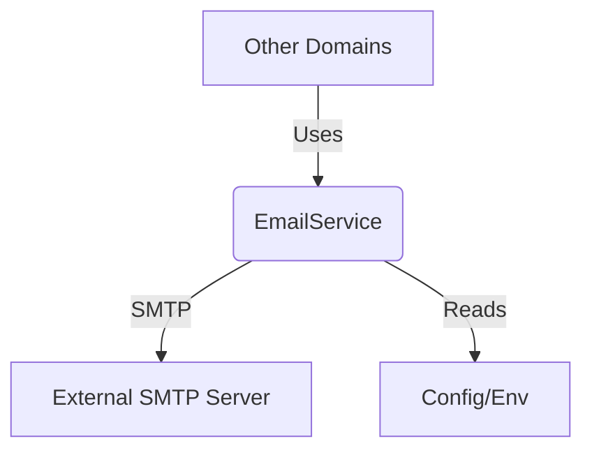

# Email Service Specification

## Overview
The Email Service provides a centralized way for the backend application to send emails using SMTP. This service is designed to be used by other domains (e.g., User Management, Alerts) to send notifications, verification emails, and other communications.

## Architecture
The Email Service is located in `backend/domain/common/infrastructure/email` and implements a simple interface for sending simple text and HTML emails.

### Component Diagram


## Configuration
To use the Email Service, the following environment variables must be set in the `.env` file:

| Variable | Description | Example |
| :--- | :--- | :--- |
| `SMTP_HOST` | The hostname of the SMTP server. | `smtp.gmail.com` |
| `SMTP_PORT` | The port of the SMTP server. | `587` |
| `SMTP_USERNAME` | The username for authentication. | `user@example.com` |
| `SMTP_PASSWORD` | The password or app password for authentication. | `secretpassword` |
| `SMTP_FROM` | The email address to use as the sender. | `noreply@example.com` |

## Usage

### Interface
```go
type EmailService interface {
    SendEmail(to []string, subject string, body string) error
    SendHTML(to []string, subject string, body string) error
}
```

### Example
```go
package main

import (
    "backend/domain/common/infrastructure/email"
    "backend/domain/common/utils"
)

func main() {
    // 1. Ensure config is loaded
    utils.LoadConfig()

    // 2. Initialize Service
    emailService := email.NewEmailService()

    // 3. Send Email
    to := []string{"recipient@example.com"}
    subject := "Test Email"
    body := "<h1>Hello!</h1><p>This is a test email.</p>"

    err := emailService.SendHTML(to, subject, body)
    if err != nil {
        // Handle error
    }
}
```

## Security Considerations
- **Environment Variables**: Never hardcode SMTP credentials in the code. Always use environment variables.
- **TLS/SSL**: The service should prefer TLS encryption for communication with the SMTP server.
