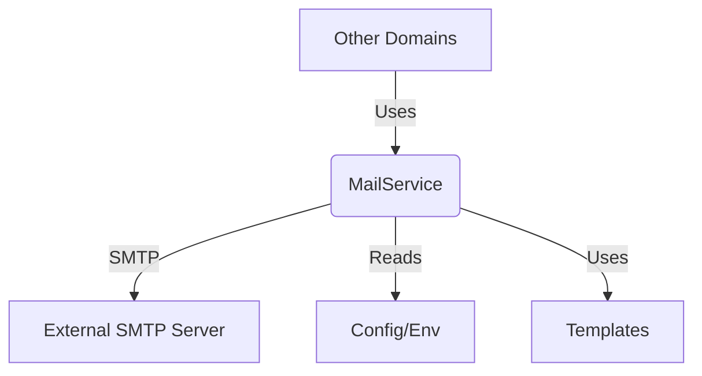

# Mail Service Specification

## Overview
The Mail Service provides a centralized way for the backend application to send emails using SMTP. This service is a dedicated domain used for notifications, verification emails, and other communications.

## Architecture
The Mail Service is located in `backend/domain/mail` and implements logic for sending HTML emails using templates.

### Component Diagram


## Configuration
To use the Mail Service, the following environment variables must be set in the `.env` file (shared with other services):

| Variable | Description | Example |
| :--- | :--- | :--- |
| `SMTP_HOST` | The hostname of the SMTP server. | `smtp.gmail.com` |
| `SMTP_PORT` | The port of the SMTP server. | `587` |
| `SMTP_USERNAME` | The username for authentication. | `user@example.com` |
| `SMTP_PASSWORD` | The password or app password for authentication. | `secretpassword` |
| `SMTP_FROM` | The email address to use as the sender. | `noreply@example.com` |

## Usage

### Controller
The `MailController` provides the following endpoints:
1. `POST /api/mail/send`: Sends an email by specifying recipient list directly.
2. `POST /api/mail/send/mac/:mac_address`: Looks up recipient email via Teralux MAC address and sends the email.

### Service
The `MailService` can be used by other domains:
```go
func (s *MailService) SendEmailWithTemplate(to []string, subject string, templateName string, data interface{}) error
```

### Example
```go
package main

import (
    "teralux_app/domain/mail/services"
    "teralux_app/domain/common/utils"
)

func main() {
    utils.LoadConfig()
    mailService := services.NewMailService(utils.GetConfig())

    to := []string{"recipient@example.com"}
    subject := "Teralux Alert"
    
    // Uses template: domain/mail/templates/summary.html
    err := mailService.SendEmailWithTemplate(to, subject, "summary", nil)
    if err != nil {
        // Handle error
    }
}
```

## Security Considerations
- **Environment Variables**: Credentials must be stored in `.env`.
- **TLS/SSL**: The service uses standard SMTP with authentication.
