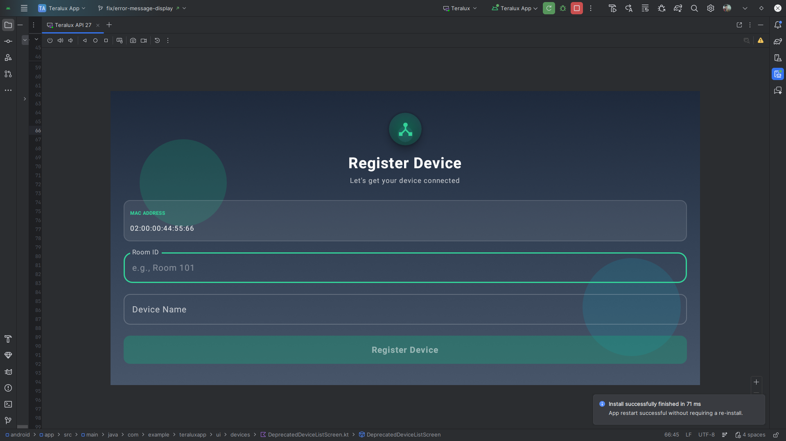

# Register Screen UI


## Description
This is the initial setup screen for the Teralux Device, used to register the physical hardware (e.g., tablet) with the backend system. It is usually seen only once during the initial deployment.

## API Used
*   **Register Teralux**: `POST /api/teralux`
*   **Request Body**:
    ```json
    {
      "mac_address": "AA:BB:CC:11:22:33",
      "room_id": "Meeting Room 1",
      "name": "Front Wall Tablet"
    }
    ```

## Flow
1.  **Display**:
    *   **MAC Address**: Automatically detected and displayed in a read-only field (e.g., `02:00:00:00:00:00`). This is crucial for hardware identification.
    *   **Inputs**:
        *   **Room ID**: The identifier for the room this device is installed in (e.g., "Meeting Room 1").
        *   **Device Name**: A friendly name for this specific Teralux unit (e.g., "Front Wall Tablet").
2.  **Interaction**:
    *   User fills in the `Room ID` and `Device Name`.
    *   Taps **"Register Device"**.
3.  **Logic**:
    *   App sends the MAC Address, Room ID, and Name to the backend.
    *   **Success**: The device is registered in the database, and the app proceeds to the **Login** screen.
    *   **Validation**: Both fields must be non-empty to enable the button.
