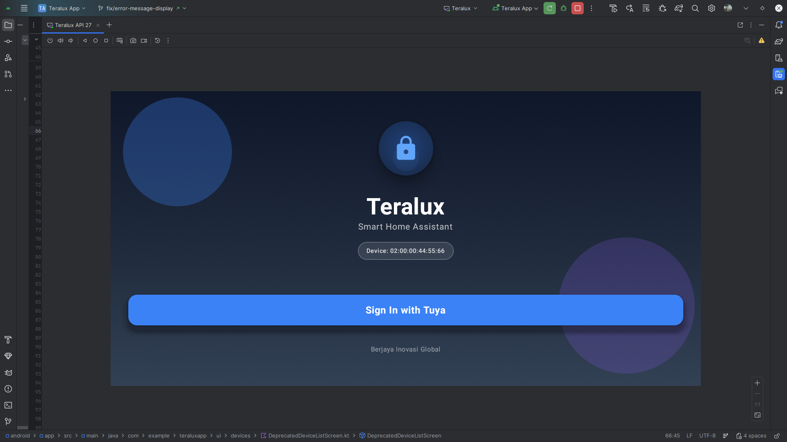

# Login Screen UI

## Description
A simplified, kiosk-style login screen designed for quick access. It acts as the gatekeeper for day-to-day operations.

## API Used
*   **Authenticate**: `GET /api/tuya/auth` (or `/api/auth/login` depending on exact route implementation).

## Flow
1.  **Display**:
    *   Animated background to provide visual feedback of a live system.
    *   **Device Identification**: Shows the MAC Address again for confirmation.
2.  **Interaction**:
    *   **Single Button**: "Sign In with Tuya".
    *   **No Password Input**: The device authenticates itself using its registered credentials/identity (likely secured via backend validation of the request source or pre-configured tokens).
3.  **Logic**:
    *   On click, shows a circular loading indicator.
    *   **Success**: Navigates to the **Room Status** page.
    *   **Failure**: Shows an error message (e.g., "Network Error").
