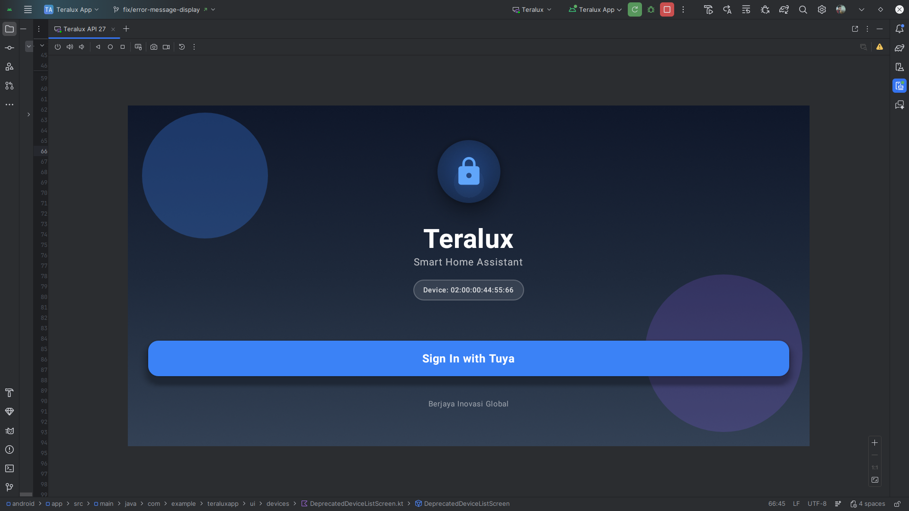

# Login Screen UI


## Description
A simplified, kiosk-style login screen designed for quick access. It acts as the gatekeeper for day-to-day operations.

## API Used
*   **Authenticate**: `POST /api/common/login`

## Authentication
This endpoint requires the `X-API-KEY` header with a valid API key.

**Request**:
```http
POST /api/common/login
X-API-KEY: your-api-key
Content-Type: application/json

{
    "terminal_id": "550e8400-e29b-41d4-a716-446655440000"
}
```

**Response** (Success):
```json
{
    "status": true,
    "message": "Login successful",
    "data": {
        "terminal_id": "...",
        "access_token": "eyJ...",
        "status": "renewed"
    }
}
```

**Response** (Error - Missing API Key):
```json
{
    "status": false,
    "message": "Invalid API Key"
}
```

## Flow
1.  **Display**:
    *   Animated background to provide visual feedback of a live system.
    *   **Device Identification**: Shows the MAC Address again for confirmation.
2.  **Interaction**:
    *   **Single Button**: "Sign In with Tuya".
    *   **No Password Input**: The device authenticates itself using its registered credentials via backend validation (requires valid X-API-KEY).
3.  **Logic**:
    *   On click, shows a circular loading indicator.
    *   **Success**: Navigates to the **Room Status** page.
    *   **Failure**: Shows an error message (e.g., "Network Error").