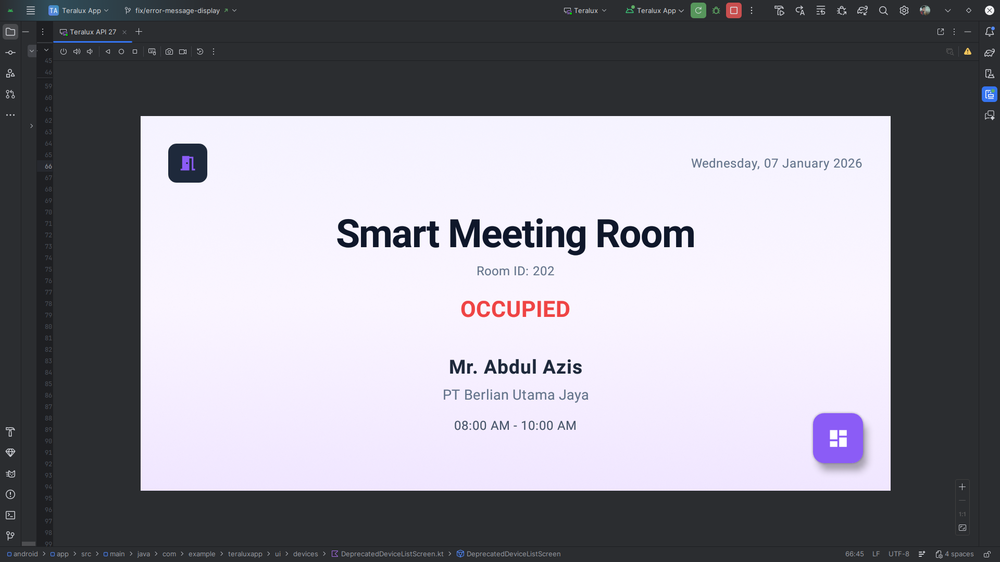
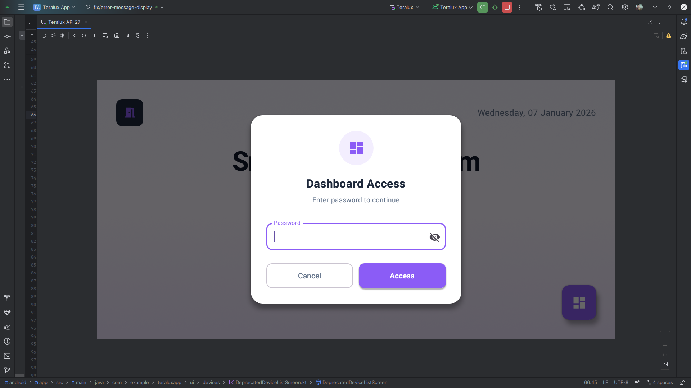

# Room Status UI

## Description
The default "Digital Door Sign" mode. It displays the current occupancy status of the room.

## API Used
*   **Data Source**: Fetches room status from Teralux Backend (e.g., `GET /api/teralux/{id}`).

## Flow
1.  **Status Indication**:
    *   **VACANT**: Green. Room is free.
    *   **BOOKED**: Amber. Meeting scheduled soon.
    *   **OCCUPIED**: Red. Meeting in progress.
2.  **Information Display**:
    *   **Room Name**: Large, clear text (e.g., "Conference A").
    *   **Booking Details**: If occupied, shows:
        *   Guest Name
        *   Company
        *   Time Range
3.  **Dashboard Access Control**:
    *   **Condition**: The "Dashboard" action button **only appears** if the status is **OCCUPIED**.
    *   **Security**: Clicking the button triggers a **Password Dialog**.
    
    
    
    *   **Logic**: User enters a local PIN/Password. If correct, they gain access to the control **Dashboard**.
