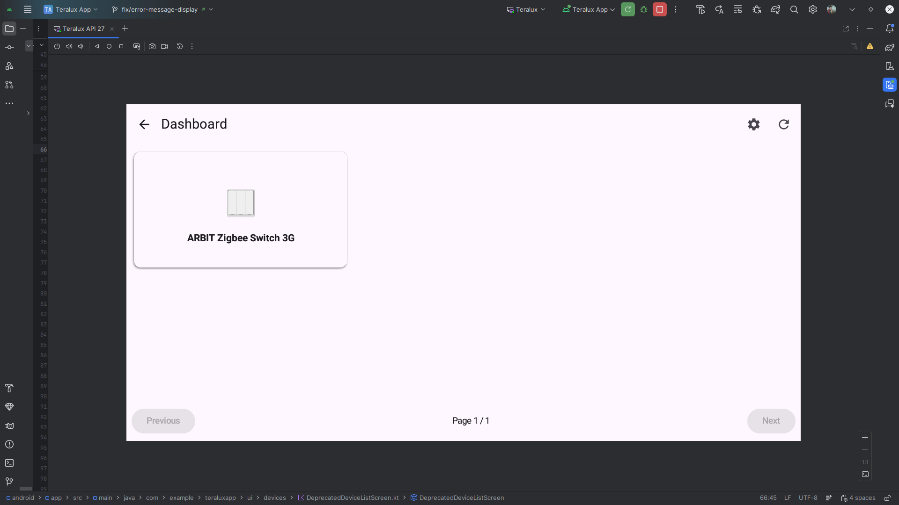

# Dashboard UI

## Description
The main control panel for the room's smart devices.

## API Used
*   **Fetch Devices**: `GET /api/devices/teralux/{teraluxId}` (Paginated)
*   **Parameters**: `page=1`, `limit=6`

## Flow
1.  **Grid Layout**:
    *   Displays connected devices in a **2x3 Grid** (6 items max per page).
2.  **Device Cards**:
    *   Each card shows the device **Icon**, **Name**, and **Status**.
    *   **Online Status**: Currently forced to "Online" in the code to ensure availability visualization.
3.  **Pagination**:
    *   **Controls**: "Previous" and "Next" buttons at the bottom.
    *   **Indicator**: "Page X / Y".
4.  **Navigation**:
    *   **Top Bar**: Back button (returns to Room Status), Refresh button, and Settings icon.
    *   **Device Click**: Tapping a device card navigates to the appropriate screen based on category:
        *   **Switch devices** (e.g., `kg`, `tdq`) → [Switch Control Screen](7_switch_control.md)
        *   **IR AC devices** (category: `infrared_ac`) → [Smart AC Control Screen](8_ac_control.md)
        *   **Sensor devices** (e.g., temperature/humidity) → [Temperature & Humidity Monitoring](6_temp_humidity_monitoring.md)
5.  **Error Handling**:
    *   Shows a "Retry" button if the API call fails or times out.
