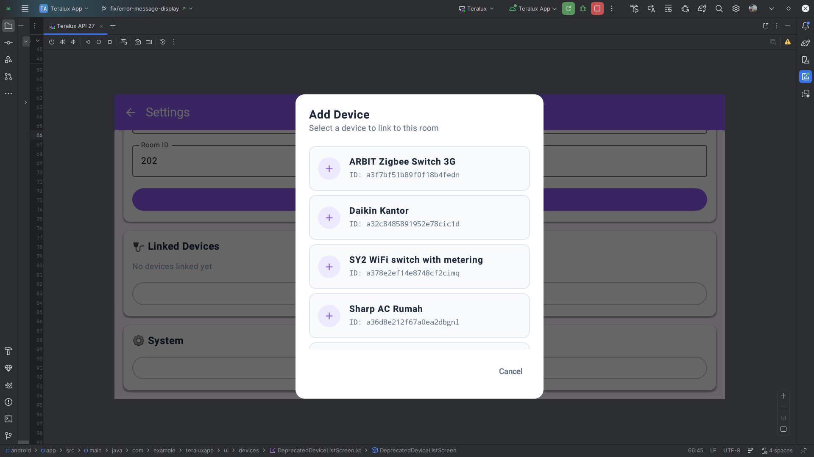
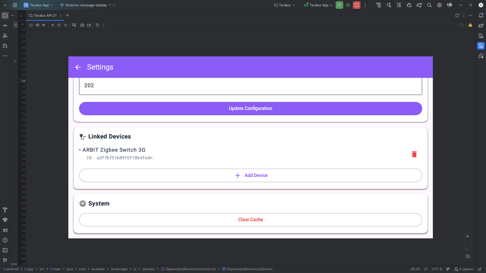

# Settings Screen UI

## Description
Administrative panel for configuring the Teralux unit and managing linked devices.

## API Used
*   **Get Info**: `GET /api/teralux/{id}`
*   **Update Info**: `PUT /api/teralux/{id}`
*   **List Linked**: `GET /api/devices/teralux/{teraluxId}`
*   **Link Device**: `POST /api/devices`
*   **Unlink Device**: `DELETE /api/devices/{id}`
*   **Flush Cache**: `DELETE /api/cache/flush`

## Flow
1.  **Device Information**: Read-only display of Teralux ID and MAC Address.
2.  **Configuration**:
    *   Edit **Device Name** and **Room ID**.
    *   "Update Configuration" saves changes.
3.  **Linked Devices**:
    *   **List**: Shows all Tuya devices currently mapped to this controller.
    
    
    
    *   **Add Device**: Opens a dialog fetching *all* available Tuya devices from the cloud. User selects one to link it.
    
    
    
    *   **Delete**: Removes the link between the Tuya device and this Teralux unit.
4.  **System**:
    *   **Clear Cache**: Flushes local storage (BadgerDB) to resolve synchronization issues.
