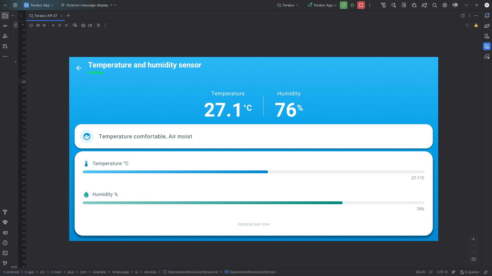

# Temperature & Humidity Monitoring UI

## Description
A monitoring screen for environmental sensors that track temperature and humidity levels in real-time.

## API Used
*   **Get Sensor Data**: `GET /api/tuya/devices/{id}`

## Flow
1.  **Initialization**:
    *   Calls `GET /api/tuya/devices/{id}` to fetch sensor device details.
    *   Parses `status` array to extract temperature and humidity readings.
2.  **Display**:
    *   Shows device name and online status in the top bar.
    *   **Main Display**: Large, clear readings for:
        *   **Temperature**: Current value in Celsius (e.g., "24°C")
        *   **Humidity**: Current percentage (e.g., "65%")
    *   Visual indicators or gauges may be used for better readability.
3.  **Refresh**:
    *   Data is read-only and refreshed when the screen is opened.
    *   No control actions available (monitoring only).
4.  **Status Codes**:
    *   Common codes: `va_temperature`, `va_humidity`, `temp_current`, `humidity_value`
    *   Values are typically numeric (temperature in Celsius, humidity as percentage).
