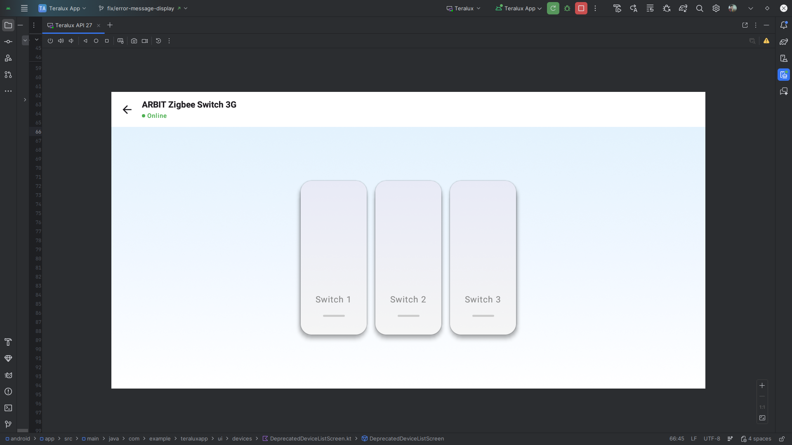

# Switch Device Control UI


## Description
A dedicated control screen for smart switches (1-gang, 2-gang, 3-gang, etc.). Displays vertical switch panels with ON/OFF indicators.

## API Used
*   **Get Device Status**: `GET /api/tuya/devices/{id}`
*   **Send Command**: `PUT /api/devices/{id}/status`

## Flow
1.  **Initialization**:
    *   Calls `GET /api/tuya/devices/{id}` to fetch device details and current status.
    *   Parses `status` array to find all fields with code containing "switch" (excluding countdown, relay, light).
    *   Dynamically generates switch panels based on available switch codes (e.g., `switch_1`, `switch_2`).
2.  **Display**:
    *   Shows device name and online status in the top bar.
    *   Renders vertical switch panels (120px wide, 280px tall) in a horizontal row.
    *   Each panel shows:
        *   Label (e.g., "Switch 1", "Switch 2")
        *   Visual indicator (green bar when ON, gray when OFF)
        *   Gradient background (brighter when ON)
3.  **Interaction**:
    *   User taps a switch panel to toggle.
    *   **Optimistic Update**: UI updates immediately.
    *   Sends `PUT /api/devices/{id}/status` with:
        ```json
        {
          "code": "switch_1",
          "value": true
        }
        ```
    *   **Rollback**: If API call fails, reverts the UI state.
4.  **Offline Handling**:
    *   Entire screen is dimmed (50% opacity) when device is offline.
    *   Tapping switches shows "Device is offline" snackbar.
