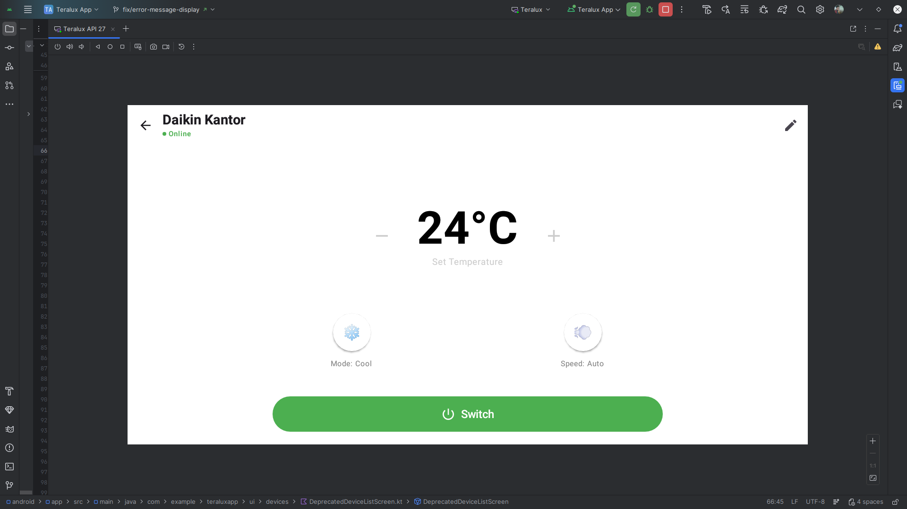

# Smart AC Control UI


## Description
A dedicated control screen for Air Conditioners connected via Smart IR Hub. Provides temperature, mode, and fan speed controls.

## API Used
*   **Get Device Status**: `GET /api/tuya/devices/{id}`
*   **Send IR Command**: `PUT /api/devices/{id}/status`

## Flow
1.  **Initialization**:
    *   Calls `GET /api/tuya/devices/{id}` to fetch AC remote status.
    *   Parses status codes: `power`, `temp`, `mode`, `wind`.
    *   **Value Format**: All values are integers:
        *   `power`: 0 (off), 1 (on)
        *   `mode`: 0 (cool), 1 (heat), 2 (auto), 3 (fan), 4 (dry)
        *   `temp`: 16-30 (celsius)
        *   `wind`: 0 (auto), 1 (low), 2 (medium), 3 (high)
2.  **Display**:
    *   **Center**: Large temperature display (72sp) with +/- buttons.
    *   **Bottom**: 
        *   Mode button (circular, shows emoji: ❄️🔥🔄💨💧)
        *   Fan speed button (circular, shows 💨)
        *   Power switch (wide pill-shaped button, green when ON)
3.  **Interaction**:
    *   **Temperature**: Tap +/- to adjust (16-30°C range).
    *   **Mode**: Tap to cycle through Cool → Heat → Auto → Fan → Dry.
    *   **Fan Speed**: Tap to cycle through Auto → Low → Medium → High.
    *   **Power**: Tap to toggle ON/OFF.
    *   Each interaction sends `PUT /api/devices/{id}/status` with:
        ```json
        {
          "remote_id": "actual_ac_remote_id",
          "code": "temp",
          "value": 24
        }
        ```
4.  **Offline Handling**:
    *   Screen dimmed to 50% opacity when offline.
    *   Commands blocked with "Device is offline" snackbar.
