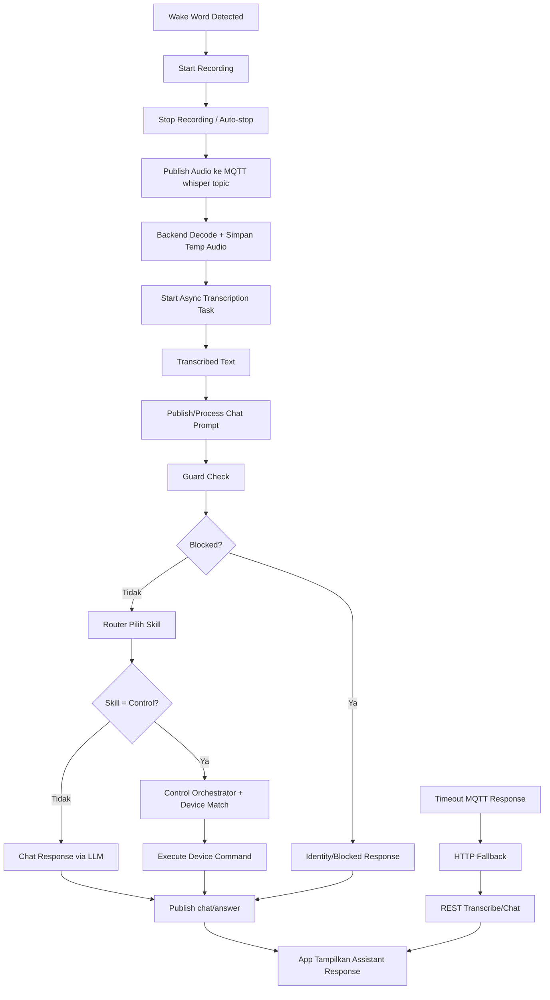
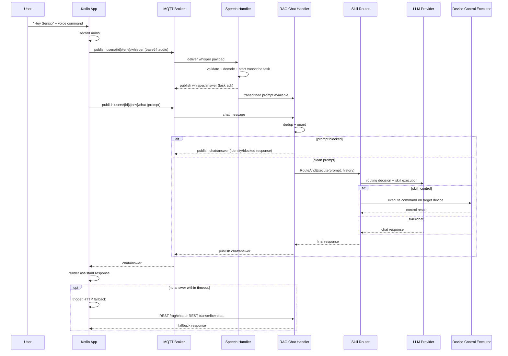

# Report Plan: Alur Voice Control AI Assistant (Kotlin -> Backend -> LLM -> Device Control)

## Summary

Dokumen ini menjelaskan alur voice control AI assistant dengan format yang sama seperti report chunking sebelumnya: ringkasan, alur end-to-end, algoritma utama, diagram, analisis token/cost, dan rekomendasi optimasi. Fokusnya adalah mode produksi yang sekarang: jalur utama via MQTT, jalur cadangan via HTTP fallback, lalu routing ke chat atau kontrol perangkat.

## Tujuan dan Success Criteria

1. Menjelaskan alur voice control dari wake word sampai respons assistant.
2. Menjelaskan decision flow kapan prompt jadi chat biasa vs kontrol perangkat.
3. Menjelaskan peran MQTT, transkripsi, orchestrator skill router, dan kontrol Tuya.
4. Menyediakan diagram flow dan sequence untuk presentasi internal.
5. Menjawab apakah alur ini boros token LLM atau tidak.
6. Menyertakan rekomendasi operasional agar reliabel dan efisien.

## Scope

1. In scope:
1. Alur wake word + perekaman audio di app.
1. Publish voice/chat ke MQTT.
1. Backend whisper MQTT ingestion dan transkripsi async.
1. Backend chat routing (Guard -> Router -> Skill execution).
1. Kontrol device via Control skill.
1. HTTP fallback saat timeout respons MQTT.
1. Dampak token LLM.
1. Out of scope:
1. Detail UI styling.
1. Detail line-by-line file code.
1. Benchmark latency numerik final (kecuali guideline).

## 1) Ringkasan Eksekutif

Sistem voice control menggunakan arsitektur hybrid:

1. Jalur utama realtime via MQTT untuk voice/chat.
2. Jalur cadangan via HTTP jika MQTT response timeout.
3. Backend melakukan transkripsi suara, lalu memproses prompt lewat router skill.
4. Router menentukan apakah request:
5. Ditangani sebagai chat biasa.
6. Dieksekusi sebagai control command ke perangkat.
7. Hasil dipublish kembali ke client sebagai jawaban assistant.

Tujuan utama:

1. Responsif untuk interaksi suara.
2. Tahan gangguan koneksi/timeout.
3. Tetap aman dari spam/prompt tidak relevan.
4. Konsisten untuk use case chat dan device control.

## 2) Alur End-to-End (Konseptual)

## 3) Algoritma Utama

### A. Algoritma voice input (App side)

1. Listener mendeteksi wake word.
2. App mulai rekam audio.
3. Rekaman berhenti manual atau auto-stop timeout.
4. Audio dikirim sebagai base64 ke topic MQTT whisper.
5. App pindah ke state `WaitingResponse`.
6. Jika tidak ada jawaban dalam SLA timeout, jalankan HTTP fallback.
7. Saat jawaban diterima, state selesai dan bubble assistant diperbarui.
8. Dedup user message diterapkan agar tidak spam duplicate bubble.

### B. Algoritma speech ingestion + transcription (Backend side)

1. Subscriber MQTT menerima payload whisper.
2. Validasi field wajib (`audio`, `terminal_id`).
3. Set flag transkripsi aktif untuk hindari race dengan chat text paralel.
4. Decode base64 audio dan simpan file temporer.
5. Submit task transkripsi async.
6. Publish ack task ke topic whisper/answer.
7. Worker transkripsi menghasilkan teks.
8. Teks dipakai sebagai input ke alur chat assistant.

### C. Algoritma chat routing (Backend side)

1. Prompt masuk dari MQTT chat atau REST chat.
2. Terapkan dedup prompt berbasis terminal + time window.
3. Guard classifier menilai spam/irrelevant.
4. Jika blocked, return safe identity response.
5. Jika clean, router LLM memilih skill terbaik.
6. Jika skill tidak valid, fallback ke Identity skill.
7. Skill dieksekusi lalu opsional diterjemahkan sesuai language target.
8. Riwayat chat disimpan terbatas (rolling window) untuk context lanjutan.

### D. Algoritma control execution (Skill Control)

1. Ambil daftar device user dari store/vector.
2. Coba fast-match nama perangkat di prompt.
3. Jika match tunggal, langsung eksekusi kontrol.
4. Jika ambigu, pakai prompt LLM control untuk resolve target/action.
5. Parse action command dari output skill.
6. Pilih sensor/controller sesuai kategori device.
7. Eksekusi command ke device executor.
8. Kembalikan pesan hasil eksekusi + status code.

### E. Algoritma fallback (App side)

1. Jika timeout MQTT response, switch ke fallback mode.
2. Jika request type chat:
3. Panggil REST `/rag/chat`.
4. Jika request type audio:
5. Panggil REST transcribe.
6. Poll status sampai teks tersedia.
7. Lanjut panggil REST chat dengan hasil transkrip.
8. Tampilkan hasil ke UI.
9. Jika fallback juga gagal, set state failed.

## 4) Diagram Sequence (Untuk Presentasi)

## 5) Jawaban Pertanyaan Token: Boros atau Tidak?

Jawaban singkat:

1. Alur voice control ini tidak otomatis boros, tapi ada kondisi yang bisa menaikkan token.
2. Boros utama terjadi jika fallback sering aktif atau prompt diproses ganda.
3. Untuk control command yang langsung fast-match dan tanpa reasoning panjang, token relatif hemat.

Penjelasan praktis:

1. Token dipakai saat:
1. Routing prompt ke LLM.
1. Eksekusi skill chat/control berbasis LLM.
1. Opsional translasi output.
1. Token bisa meningkat jika:
1. MQTT timeout sering memicu HTTP fallback.
1. Prompt duplikat tidak terfilter.
1. Control prompt terlalu panjang (history/device list besar).
1. Kesimpulan:
1. Desainnya efisien jika jalur utama MQTT sehat dan dedup berjalan.
1. Bisa terasa boros jika sistem sering masuk mode retry/fallback berulang.

## 6) Rekomendasi Optimasi (Reliability + Token)

1. Pertahankan dedup ketat pada app dan backend.
2. Batasi panjang history yang dikirim ke LLM untuk routing/control.
3. Ringkas device list context sebelum prompt control.
4. Gunakan timeout adaptif agar fallback tidak terlalu agresif.
5. Pisahkan model:
6. Model ringan untuk routing.
7. Model lebih kuat hanya saat control reasoning kompleks.
8. Tambahkan observability wajib:
9. `mqtt_publish_success_rate`
10. `mqtt_answer_latency`
11. `fallback_rate`
12. `duplicate_drop_count`
13. `llm_input_tokens`
14. `llm_output_tokens`
15. `cost_per_voice_request`

## Public Interface Konseptual Yang Dicantumkan

1. `VoiceRequest`:
1. `audio`/`prompt`
1. `terminal_id`
1. `language`
1. `request_id`
1. `AssistantResponse`:
1. `response`
1. `is_control`
1. `is_blocked`
1. `request_id`
1. `source` (MQTT/HTTP fallback)
1. `ControlResult`:
1. `message`
1. `device_id`
1. `status_code`
1. `ProcessingState`:
1. `recording`
1. `publishing`
1. `waiting_response`
1. `fallback_running`
1. `completed/failed`

## Test Cases dan Skenario Validasi

1. Wake word memicu rekam otomatis saat MQTT online.
2. Audio publish MQTT berhasil dan task ack diterima.
3. Prompt chat normal menghasilkan jawaban assistant.
4. Prompt spam/irrelevant diblok guard dengan respons aman.
5. Prompt control valid mengeksekusi device action.
6. Prompt duplikat dropped dalam time window.
7. MQTT timeout memicu fallback dan tetap menghasilkan jawaban.
8. Fallback gagal mengubah state ke failed dengan error handling benar.
9. Race condition audio + text bersamaan tidak menghasilkan double execution.
10. Token/cost per request stabil pada traffic normal.

## Asumsi dan Default

1. Audiens adalah rekan kerja teknis internal.
2. Format final adalah Markdown + Mermaid.
3. Fokus penjelasan adalah alur dan algoritma, bukan file implementation detail.
4. Jalur utama dianggap MQTT-first, HTTP sebagai fallback.
5. Voice control mencakup dua outcome: conversational response dan device control.
